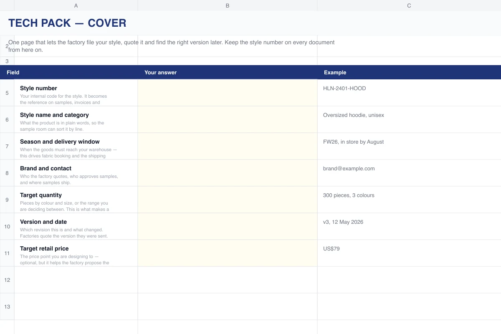

# Free Tech Pack Template for Clothing (Excel + PDF)

A fill-in garment tech pack in seven sheets, written by a clothing factory from
the side that has to read these documents. No sign-up, no macros, free to use
and adapt for commercial work.

## Download

| File | Use it when |
| --- | --- |
| [hln-tech-pack-template.xlsx](hln-tech-pack-template.xlsx) | You want to fill it in on a computer (Excel, Google Sheets, Numbers, LibreOffice) |
| [hln-tech-pack-template.pdf](hln-tech-pack-template.pdf) | You want to print it and fill it in by hand, or see the structure first |
| [hln-international-size-chart.pdf](hln-international-size-chart.pdf) | You need US / UK / EU / JP / CN / international size conversions (women and men) next to your measurement sheet |

The web version, with a worked explanation of every field, lives at
**[hlnapparel.com/tools/tech-pack-template](https://www.hlnapparel.com/tools/tech-pack-template)**.

## What is in the workbook

Each sheet has the fields a factory needs, an empty column for your answer and a
filled example so you can see the level of detail expected.

| # | Sheet | What it settles |
| --- | --- | --- |
| 1 | **Cover** | Style number, category, season, target quantity, version and date. The style number goes on every document after this. |
| 2 | **Sketch** | Front and back views, numbered callouts, reference garments, point-of-measure lines. A marked-up photo is fine. |
| 3 | **BOM** | Every material on its own line: body fabric, rib, trims, labels, packaging, with composition, weight, colour and consumption per piece. |
| 4 | **Measurements** | One row per point of measure, one column per size, a tolerance and a unit. Bulk goods are inspected against this sheet. |
| 5 | **Construction** | Stitch type and density, seam finish, thread, print and embroidery position and size, hardware, topstitching. |
| 6 | **Labels & packaging** | Main label, care label, hang tag, fold and polybag, barcodes, carton packing. |
| 7 | **Colorways** | Colour names, a physical colour reference, quantity per colour and the size breakdown. |

## How to use it

1. Give the style a number on the Cover sheet and keep it on everything you send.
2. Fill the sheets in order. Skip a field rather than guess; a blank gets a
   question from the factory, a wrong value gets sewn.
3. Put a tolerance on every measurement. "Chest 56 cm" and "Chest 56 cm ± 1" are
   different instructions at inspection.
4. Reference colours to something physical (a Pantone TCX code or a swatch),
   never to a screen.
5. Bump the version and date whenever anything changes, and send the whole file
   again rather than a list of edits.

No tech pack yet? A reference garment, a few photos and target measurements are
enough to start a sample with most factories, including ours. The template is
what turns that first sample into an order that can be repeated.

## Related free tools

- [GSM to oz/yd² fabric weight converter](https://www.hlnapparel.com/tools/gsm-to-oz)
- [International clothing size chart](https://www.hlnapparel.com/tools/size-chart)
- [All tools](https://www.hlnapparel.com/tools)

## Who made this

[Hualingniao (HLN Apparel)](https://www.hlnapparel.com) is a custom clothing
manufacturer working with brands on private-label and OEM orders. If you have a
finished tech pack, or only an idea and a reference garment, you can
[send it to us for a quote](https://www.hlnapparel.com/contact).

## License

[CC BY 4.0](LICENSE). Use it, change it, ship it with your own course, blog or
product. The one condition is attribution: credit "HLN Apparel" with a link to
<https://www.hlnapparel.com/tools/tech-pack-template>.

Found a mistake or a missing field? Open an issue.
